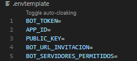

# BotcchiV2

Repositorio re escritura de codigo para el bot Botcchi escrito en python. Sin depender del proyecto Vulkan.

## Requisitos

* Python 3.13.3 (No se ha probado en otras versiones)
* ffmpeg - setear su binario para ejecución de ambiente
* git

## Instalación

1. Clona el repostorio

   ```ps1
   git clone https://github.com/notGabo/BotcchiV2.git
   ```
2. Entra al working directory

   ```ps1
   cd ./BotcchiV2
   ```
3. Genera un ambiente virtual con python

   Windows:

   ```ps1
    python -m venv {nombre de tu venv} && ./{nombre de tu venv}/Scripts/activate.ps1 
   ```
   ó

   ```
    python -m venv {nombre de tu venv} && ./{nombre de tu venv}/Scripts/activate.bat 
   ```
   Linux

   ```bash
   python3 -m venv {nombre de tu venv} && source {nombre de tu venv}/Scripts/bin/activate
   ```
4. Instalar modulos

   ```
   pip3 install -r requeriments.txt
   ```
5. Genera tu .env en base a la plantilla existente

   

   *nota: BOT_SERVIDORES_PERMITIDOS es un array de las guild ID de cada server separado por coma. Ej: BOT_SERVIDORES_PERMITIDOS=11111,22222,3333,4444
6. Levanta el bot

   ```
   python3 main.py
   ```
